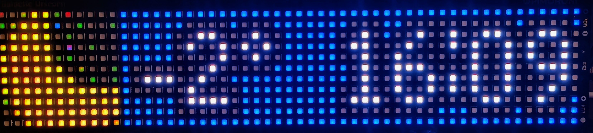
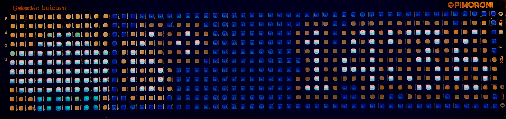

# GU_WeatherClock
A Weatrher display and Clock on the Pimoroni Galactic Unicorn



# Usage
Upload everything (example example images) to your Galactic Unicorn (Using Thony or your choice of tools)

Edit ```main.py```

Line 32 & 33:
```
city = 'MARS'
country_code = 'UK'
```
Add your city and country

Get your API key from 
https://home.openweathermap.org/api_keys

Edit ```secrets.py``` with your WIFI details and your Open Weather Map API Key

```
WIFI_SSID = 'YOUR SSID'
WIFI_PASSWORD = 'YOURPSK'
WIFI_COUNTRY = 'GB'
API_KEY = 'APIKEY'
```

---
Special thanks goes to the original icon author
https://www.dovora.com/resources/weather-icons/

---
Get your display from Pimoroni : https://shop.pimoroni.com/products/space-unicorns?variant=40842033561683 
